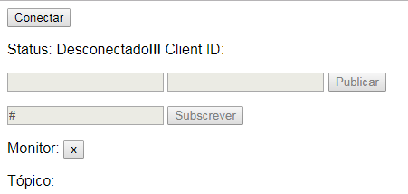

## MQTT_pub_sub
Exemplo básico de pub/sub no broker mqtt com JS, o protocolo mqtt é muito utilizado para comunicação entre objetos em IOT (Internet of things) e ideal para dispositivos de baixa potência.

## Broker MQTT 
Foi utilizado o HiveMQ como broker pois da suporte a websckets no SO windows mas pode ser usado o Mosquitto para o linux ou qualquer outro broker de preferencia.

## Configuração
- Configurar porta, host, topico e etc no arquivo /assets/config.js
- Executar index.html

## Tecnologias utilizadas
- [MQTT](http://mqtt.org/) 3.1.1
- [HiveMQ](https://www.hivemq.com/) 3.2.4
- [Paho](https://www.eclipse.org/paho/clients/js/) 1.0.1
- [jquery](https://jquery.com) 3.2.1

 

